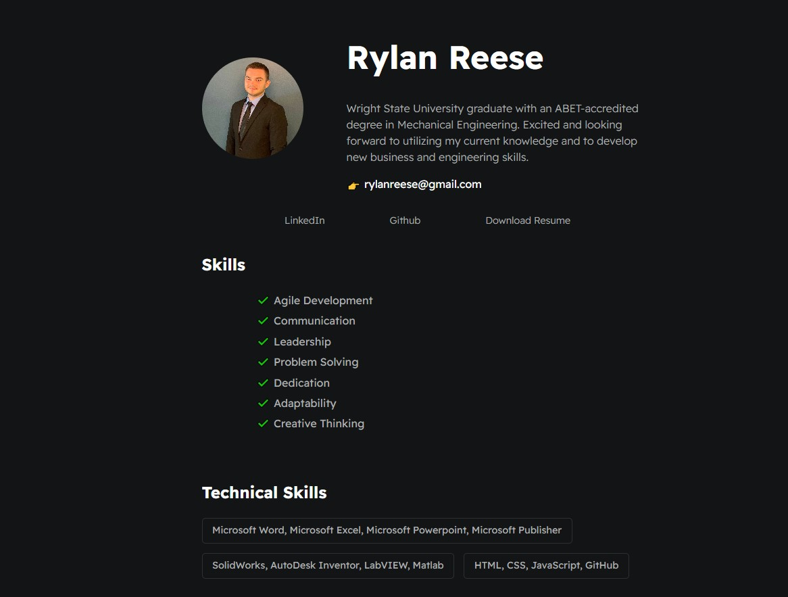
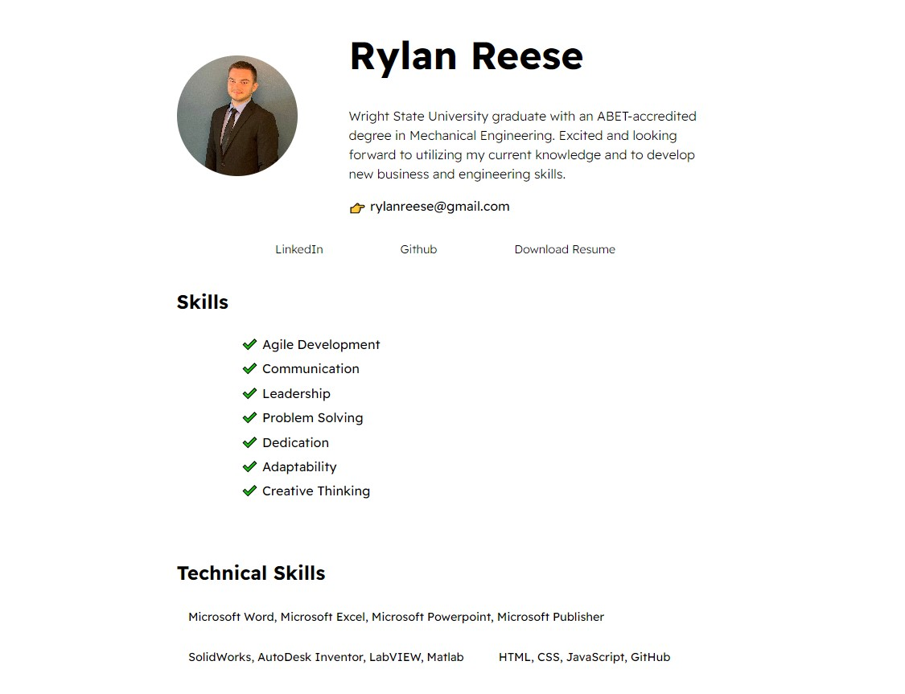

# Rylan Reese Resume

A digital portfolio based on the content from my
[resume](./assets/RylanReese_Resume2022.pdf)

View live demo here using github pages: [Live Demo](https://github.com/RAC11/Resume-Website)

<figure class=videoContainer>
<iframe src="https://rac11.github.io/Random-Choice-Picker/" width="500" height="500" title="Random Choice Picker"></iframe>
</figure>
## Dark Mode Preview



## Light Mode Preview



## Switching between color themes

This website has no auto toggle theme switcher, therefor to change themes you must manual go into `main.css` and the css variables to use either theme. Default is dark, so do the following here:

```css
--mainTextColor: var(--mainTextColor-light);
--secondaryTextColor: (--secondaryTextColor-light);
--mainLinkColor: var(--mainLinkColor-light);
--mainBorderColor: var(--mainBorderColor-light);
--mainBgColor: var(--mainBgColor-light);
```
